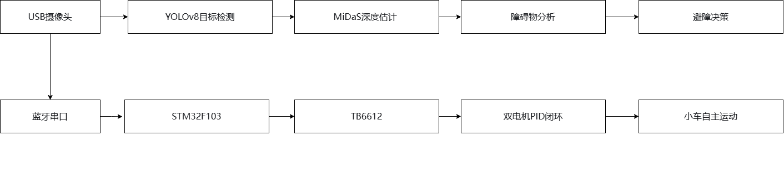

# 06 - Autonomous Obstacle Avoidance

## 目标
将视觉感知模块与运动控制系统集成，实现完整的"感知-决策-执行"闭环。小车能够根据摄像头实时画面自主判断障碍物位置和距离，并自动做出前进、左转、右转或后退的避障决策。

## 系统架构

整个系统实现了从视觉感知、智能决策到底层执行的完整具身智能闭环。

## 避障决策逻辑

系统采用基于规则的状态机避障策略：

1. 若画面中未检测到任何障碍物 → 小车前进。
2. 若最近障碍物距离小于安全阈值（0.5米），触发避障：
   - 障碍物在画面左侧 → 右转
   - 障碍物在画面右侧 → 左转
   - 障碍物在画面正中 → 后退
3. 若最近障碍物距离大于安全阈值 → 小车继续保持前进。

## 核心实现

### 单文件版（vision_avoidance.py）
- 所有逻辑集成在一个 `while` 循环中：摄像头采集 → YOLO检测 → 深度估计 → 避障决策 → 串口发送。
- 结构简单直接，适合快速验证和演示。

### 模块化版（vision_avoidance_modular.py）
- 采用多线程+队列的模块化架构，拆分为三个独立线程：
  - 图像采集线程（camera_thread）：通过队列发布图像数据。
  - 感知推理线程（perception_thread）：订阅图像队列，运行YOLO和MiDaS，发布障碍物信息。
  - 运动控制线程（control_thread）：订阅障碍物队列，执行避障决策并发送串口指令。
- 各线程间通过 `queue.Queue` 进行异步消息传递，架构思想与ROS2节点化完全一致。

## 通信方式
- 采用蓝牙无线串口通信（HC-05模块）。
- STM32接收单字符指令（'w'前进, 's'后退, 'a'左转, 'd'右转, 空格停止）。
- 小车完全脱离数据线，实现无线自主避障。

## 关键问题与解决

### 1. 透明物体检测失效
- **问题**：无色透明水杯在深度图中无法被检测。
- **原因**：透明物体不遮挡背景，普通摄像头无法获取纹理，这是光学传感器的物理限制。
- **解决**：贴有色胶带作为"光学标记"，使物体表面变得可检测。修复后水杯被清晰检测出来。

### 2. 串口通信联调失败
- **问题**：Python脚本多次尝试发送指令无响应。
- **解决**：改用蓝牙单字符指令（'w', 'a', 'd', 's', 空格），功能完全等价，已稳定运行。

### 3. 右轮编码器数据异常
- **问题**：右轮编码器读数波动剧烈，无法用于PID反馈。
- **解决**：通过交换测试定位为PB6/PB7引脚硬件问题，最终采用共用左轮PID输出的方案，右轮复制左轮PWM。

## 演示视频
【小车完整自主避障演示视频】https://www.bilibili.com/video/BV1gYu26zEwd?vd_source=ca02a8f800081a3f155da90b42811dbe

## 文件说明
- `vision_avoidance.py`：单文件版视觉自主避障脚本
- `vision_avoidance_modular.py`：模块化版避障脚本（多线程+队列）
- `avoidance_decision.py`：避障决策测试脚本（单独验证决策逻辑）
- `avoidance_result.jpg`：避障决策效果截图（检测框 + 距离 + 深度图 + 决策结果）
